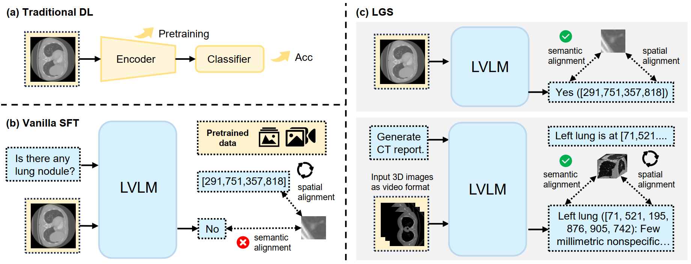

# Localization-Grounded Supervision: Revisiting Vanilla SFT of Large Vision-Language Models for Medical Image Analysis

[](TBD) [](https://huggingface.co/datasets/shiym2000/LGS) [](./LICENSE)



Localization-Grounded Supervision (LGS) is a simple and architecture-agnostic supervision framework for **LVLMs finetuning**. LGS introduces explicit localization signals into standard SFT targets, enabling LVLMs to better leverage pretrained spatial alignment and establish fine-grained vision-language semantic alignment.

LGS supports LVLM adaptation across model architectures and parameter scales. Beyond improving model **performance**, LGS also provides more **interpretable** spatial grounding for LVLMs.

## :package: Installation

``` bash
# 1. clone and navigate
git clone https://github.com/MSIIP/LGS.git
cd LGS

# 2. create a conda environment, activate it and install packages
conda create -n lgs python=3.11
conda activate lgs
pip install 'ms-swift[all]' -U
```

## :rocket: Getting Started

Take [**LUNA16**](https://luna16.grand-challenge.org/Download) as an example:

### 1. Dataset construction

``` bash
# generate 2D samples from 3D segmentation masks
python src/dataset/luna16_lgs.py
```

### 2. Training and evaluation

``` bash
# train
bash scripts/train_and_eval/sft_luna16_lgs.sh

# eval
bash scripts/train_and_eval/eval_luna16_lgs.sh
```

### 3. DePass-VL analysis (Optional)

``` bash
python src/others/draw_depass.py
```

## :book: Citation

``` bibtex
TBD
```

## :heart: Acknowledgements

We would like to express our gratitude to the following resources:
+ [**LUNA16**](https://luna16.grand-challenge.org/Download) - Chest CT dataset 3D lung nodule segmentation masks.
+ [**CrossMoDA2021**](https://crossmoda.grand-challenge.org) - MRI dataset with 3D vestibular schwannoma segmentation masks.
+ [**CT-RATE**](https://huggingface.co/datasets/ibrahimhamamci/CT-RATE) - Chest CT dataset with radiology reports.
+ [**RadGenome-Chest CT**](https://huggingface.co/datasets/RadGenome/RadGenome-ChestCT) - Chest CT dataset with grounded radiology reports.
+ [**DePass**](https://github.com/TsinghuaC3I/Decomposed-Forward-Pass) - Attribution framework for analyzing transformer-based models.
